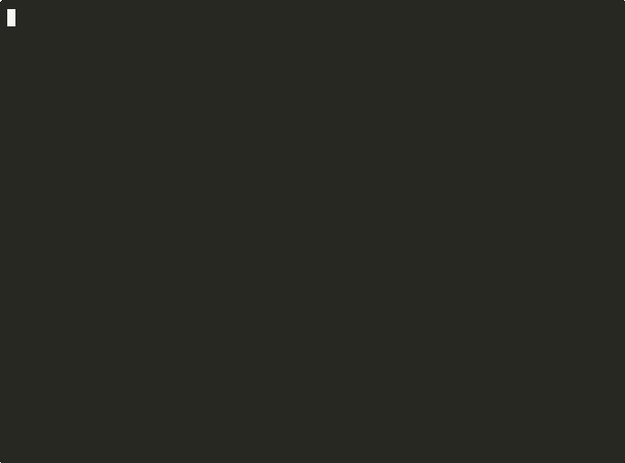

# FluffyUI

A batteries-included Terminal User Interface (TUI) framework for Go. Build interactive, responsive terminal applications with a component model, reactive state management, and an extensive widget catalog.

<p align="center">
  
</p>

<p align="center">
  
</p>

<p align="center">
  
</p>

**Reactive. Accessible. Testable. Terminal UI for Go.**

```bash
go get github.com/odvcencio/fluffyui@latest
```

## Features

- **35+ Ready-to-Use Widgets** - Buttons, forms, tables, trees, dialogs, charts, and more
- **Sub-Cell Graphics** - Canvas API with shapes, curves, images, and effects using Braille/Unicode
- **Reactive State Management** - Signals and computed values with automatic UI updates
- **Flexible Keybindings** - Registry-based commands with modes, stacking, and conditions
- **Accessibility Built-In** - Screen reader support, focus management, ARIA-like roles
- **Recording & Export** - Capture terminal sessions as asciicast or video
- **Simulation Backend** - Deterministic testing without a real terminal
- **Audio Hooks** - Opinionated music and SFX service for apps
- **Comprehensive Documentation** - Guides, examples, and GoDoc for every component

## Installation

```bash
go get github.com/odvcencio/fluffyui@latest
```

**Requirements:** Go 1.22 or later

Import path is the GitHub module path above (vanity domain is not set up yet).

## Quick Start

<p align="center">
  
</p>

```go
package main

import (
    "context"

    "github.com/odvcencio/fluffyui/fluffy"
)

func main() {
    // Create the application with defaults
    app := fluffy.NewApp()

    // Set root widget and run
    app.SetRoot(fluffy.NewLabel("Hello from FluffyUI!"))
    app.Run(context.Background())
}
```

Run the quickstart example:

```bash
go run ./examples/quickstart
```

Dev loop (auto-restart on code/style changes):

```bash
go run ./cmd/fluffy dev -- go run ./examples/quickstart
```

Audio note: the quickstart ships with tiny WAVs in `examples/quickstart/assets/audio` and auto-detects a player. Override with `FLUFFYUI_AUDIO_ASSETS=/path` or disable via `FLUFFYUI_AUDIO_ASSETS=off`.

## Agent Interaction (Out-of-Process)

FluffyUI can expose an explicit JSONL socket for agent-driven input. The default snapshot is the accessibility tree (roles/labels/values/bounds/focus). Raw screen text is opt-in and gated.

```go
import "github.com/odvcencio/fluffyui/agent"

srv, err := agent.NewServer(agent.ServerOptions{
    Addr:      "unix:/tmp/fluffyui.sock",
    App:       app,
    AllowText: false,
})
if err != nil {
    panic(err)
}
go srv.Serve(ctx)
defer srv.Close()
```

Client (JSONL):

```bash
printf '{"type":"hello","id":1}\n{"type":"snapshot","id":2}\n{"type":"key","id":3,"key":"enter"}\n' | nc -U /tmp/fluffyui.sock
```

Notes:
- `key` uses keybind syntax like `ctrl+c`, `f5`, `up`, or `a`.
- `snapshot` supports `include_text=true` only when `AllowText` (or `TestMode` in tests) is enabled.
- If you attach a recorder, agent-driven sessions are captured like normal.

Driver script:
- `scripts/agent-driver` can launch an app, connect to the agent socket, and run a JSONL script.

```bash
go run ./scripts/agent-driver \
  --addr unix:/tmp/fluffyui-candy.sock \
  --script scripts/agent-driver/scripts/candy-wars.jsonl \
  --backend sim --width 120 --height 36 \
  --record docs/demos/candy-wars.cast \
  --record-title "Candy Wars" \
  -- go run ./examples/candy-wars
```

Runner loop:
- `scripts/agent-runner` connects to the agent socket and runs a policy loop (snapshot -> decide -> act).

```bash
go run ./scripts/agent-runner \
  --addr unix:/tmp/fluffyui-candy.sock \
  --policy candy-wars-demo \
  --interval 300ms \
  --backend sim --width 120 --height 36 \
  --record docs/demos/candy-wars.cast \
  --record-title "Candy Wars" \
  -- go run ./examples/candy-wars
```

## Widget Catalog

<p align="center">
  
  
</p>

<p align="center">
  
  
</p>

### Layout Widgets

| Widget | Description |
|--------|-------------|
| `Grid` | Flexible grid layout with row/column spans |
| `Stack` | Vertical or horizontal stacking |
| `Splitter` | Resizable split panes |
| `ScrollView` | Scrollable content container |
| `Panel` | Bordered container with title |
| `Box` | Simple container with padding/margin |

### Input Widgets

<p align="center">
  
  
</p>

| Widget | Description |
|--------|-------------|
| `Button` | Clickable button with variants (primary, secondary, danger) |
| `Input` | Single-line text input with validation |
| `TextArea` | Multi-line text editor |
| `Checkbox` | Toggle checkbox with label |
| `Radio` | Radio button groups |
| `Select` | Dropdown selection |

### Data Widgets

| Widget | Description |
|--------|-------------|
| `List` | Scrollable list with selection |
| `Table` | Sortable data table with columns |
| `Tree` | Hierarchical tree view |
| `SearchWidget` | Filterable search interface |

### Navigation Widgets

| Widget | Description |
|--------|-------------|
| `Tabs` | Tabbed navigation |
| `Menu` | Dropdown/context menus |
| `Breadcrumb` | Navigation breadcrumbs |
| `Stepper` | Step-by-step wizard |
| `PaletteWidget` | Command palette (fuzzy finder) |
| `EnhancedPalette` | Extended command palette with categories |

### Feedback Widgets

| Widget | Description |
|--------|-------------|
| `Dialog` | Modal dialog boxes |
| `Alert` | Notification alerts |
| `ToastStack` | Toast notifications |
| `Spinner` | Loading spinner |
| `Progress` | Progress bars |
| `Sparkline` | Inline sparkline charts |
| `BarChart` | Simple bar charts |

## Architecture

FluffyUI uses a message-loop architecture with a hierarchical widget tree:

```
                    +-----------+
                    |    App    |
                    +-----+-----+
                          |
    +----------+----------+----------+
    |          |          |          |
 Backend   KeyHandler  Announcer  Recorder
    |
    v
+-------------------+
|   Render Pipeline |
+-------------------+
| 1. Measure        |  Widgets report preferred size
| 2. Layout         |  Parents assign bounds to children
| 3. Render         |  Widgets draw to buffer
| 4. Diff           |  Only changed cells flushed
| 5. Show           |  Backend displays updates
+-------------------+
```

### Message Flow

Input events (keyboard, mouse, resize) flow from the backend through the widget tree. Widgets handle messages and return commands for app-level actions:

```go
func (w *MyWidget) HandleMessage(msg runtime.Message) runtime.HandleResult {
    switch m := msg.(type) {
    case runtime.KeyMsg:
        if m.Rune == 'q' {
            return runtime.WithCommand(runtime.Quit{})
        }
    }
    return runtime.Unhandled()
}
```

## State Management

<p align="center">
  
  
</p>

<p align="center">
  
</p>

FluffyUI provides reactive state primitives for automatic UI updates:

```go
// Create a signal
count := state.NewSignal(0)
count.SetEqualFunc(state.EqualComparable[int])

// Read and update
current := count.Get()
count.Set(10)
count.Update(func(v int) int { return v + 1 })

// Subscribe to changes
count.Subscribe(func(newValue int) {
    fmt.Println("Count changed to:", newValue)
})

// Computed values
doubled := state.NewComputed(func() int {
    return count.Get() * 2
})
```

In widgets, use `Component.Observe()` for automatic refresh:

```go
func (c *MyWidget) Mount() {
    c.Observe(c.count, c.refresh)
}
```

## Graphics & Animation

FluffyUI includes a powerful sub-cell graphics system and animation framework:

<p align="center">
  
</p>

The graphics package provides:
- **Canvas API** - Draw shapes, curves, and images at sub-character resolution
- **Multiple Blitters** - Braille (2x4), Sextant (2x3), Quadrant (2x2), ASCII fallback
- **Transforms** - Translate, rotate, scale operations with save/restore
- **Path Operations** - BeginPath, MoveTo, LineTo, BezierCurveTo, ArcTo, Fill, Stroke

The animation package provides:
- **Tweens** - Interpolate any value with configurable easing (linear, quad, cubic, elastic, bounce)
- **Springs** - Physics-based spring animations with stiffness and damping
- **Particle Systems** - Emitters with physics (gravity, air resistance), color gradients

## Keybindings

FluffyUI's keybind system supports complex keyboard workflows:

```go
// Create registry and register commands
registry := keybind.NewRegistry()
keybind.RegisterStandardCommands(registry)  // quit, cancel, confirm, etc.
keybind.RegisterScrollCommands(registry)    // scroll-up, scroll-down, etc.
keybind.RegisterClipboardCommands(registry) // copy, paste, cut

// Create custom commands
registry.Register(keybind.Command{
    Name:        "my-action",
    Description: "Do something custom",
})

// Build keymap with bindings
keymap := keybind.NewKeymap("main")
keymap.Bind("ctrl+s", "save")
keymap.Bind("ctrl+q", "quit")

// Use keymap stacks for modes (normal, insert, etc.)
stack := &keybind.KeymapStack{}
stack.Push(keymap)
```

## Accessibility

Built-in accessibility features for screen readers and keyboard navigation:

```go
// Set up accessibility
app := runtime.NewApp(runtime.AppConfig{
    Announcer: &accessibility.SimpleAnnouncer{},
    FocusStyle: &accessibility.FocusStyle{
        Indicator: "> ",
        Style:     backend.DefaultStyle().Bold(true),
    },
})

// Widgets can implement accessibility.Accessible
type Accessible interface {
    AccessibleRole() string    // "button", "textbox", "list", etc.
    AccessibleName() string    // Human-readable name
    AccessibleState() State    // focused, selected, expanded, etc.
}
```

## Recording

Capture terminal sessions as asciicast files or export to video:

```go
// Create recorder
recorder, _ := recording.NewAsciicastRecorder("session.cast", recording.AsciicastOptions{
    Title: "My Session",
})

app := runtime.NewApp(runtime.AppConfig{
    Recorder: recorder,
    // ...
})

// After session ends, export to video
recording.ExportVideo("session.cast", "output.mp4", recording.VideoOptions{
    Agg: recording.AggOptions{
        Theme:    "monokai",
        FontSize: 16,
        FPS:      30,
    },
})
```

Or use environment variables:

```bash
FLUFFYUI_RECORD=session.cast go run ./examples/quickstart
FLUFFYUI_RECORD=session.cast FLUFFYUI_RECORD_EXPORT=output.mp4 go run ./examples/quickstart
```

## Testing

Use the simulation backend for deterministic tests without a terminal:

```go
import "github.com/odvcencio/fluffyui/backend/sim"

func TestMyWidget(t *testing.T) {
    // Create simulation backend
    be := sim.New(80, 24)

    app := runtime.NewApp(runtime.AppConfig{
        Backend: be,
        // ...
    })

    // Inject input events
    be.InjectKey(tcell.KeyEnter, 0, tcell.ModNone)

    // Check rendered output
    if !be.ContainsText("Expected text") {
        t.Error("Expected text not found")
    }
}
```

## Examples

Run any example with `go run`:

| Example | Description |
|---------|-------------|
| `examples/quickstart` | Basic app setup and message handling |
| `examples/counter` | State management with signals |
| `examples/todo-app` | Full CRUD application |
| `examples/candy-wars` | **Showcase game** - Trading game demonstrating all features |
| `examples/fireworks-demo` | **3D particle effects** - Fireworks with perspective projection |
| `examples/command-palette` | Keybind registry and command palette |
| `examples/file-browser` | Tree navigation and file system |
| `examples/dashboard` | Data visualization with charts |
| `examples/settings-form` | Form validation and submission |
| `examples/accessibility-demo` | Screen reader and focus features |
| `examples/recording` | Session recording and export |
| `examples/generate-demos` | Automated demo recording tool |
| `examples/widgets/gallery` | Complete widget showcase |
| `examples/widgets/layout` | Layout widget demos |
| `examples/widgets/input` | Input widget demos |
| `examples/widgets/data` | Data widget demos |
| `examples/widgets/navigation` | Navigation widget demos |
| `examples/widgets/feedback` | Feedback widget demos |

```bash
go run ./examples/candy-wars  # Try the showcase game!
go run ./examples/todo-app
```

### Candy Wars - Showcase Game

A complete trading game set in a middle school, demonstrating FluffyUI's capabilities:

- Navigate between locations (Cafeteria, Gym, Library, etc.)
- Buy and sell candy with dynamic pricing
- Avoid teachers and hall monitors (random events)
- Pay off your debt before time runs out
- Features: Tables, dialogs, sparklines, reactive state, keybindings

```bash
go run ./examples/candy-wars
```

Recorded demo:

```bash
asciinema play docs/demos/candy-wars.cast
```

Re-record with the agent driver:

```bash
go run ./scripts/agent-driver \
  --addr unix:/tmp/fluffyui-candy.sock \
  --script scripts/agent-driver/scripts/candy-wars.jsonl \
  --backend sim --width 120 --height 36 \
  --record docs/demos/candy-wars.cast \
  --record-title "Candy Wars" \
  -- go run ./examples/candy-wars
```

## Demos

Pre-recorded demos are available in `docs/demos/` as asciicast files:

```bash
# View a demo (requires asciinema)
asciinema play docs/demos/hero.cast
```

### Recording Tools

FluffyUI includes two Go-based recording tools:

| Tool | Description |
|------|-------------|
| `examples/generate-demos` | Headless demo generation using simulation backend (CI-friendly) |
| `scripts/record-demos` | Record real examples with terminal interaction |
| `scripts/agent-driver` | Scripted agent driver for replayable input (JSONL) |
| `scripts/agent-runner` | Policy-driven agent loop for realtime interaction |

```bash
# Generate widget demos (no terminal required, great for CI)
go run ./examples/generate-demos --out docs/demos

# Record real examples (requires terminal)
go run ./scripts/record-demos --duration 5s

# Record specific demos only
go run ./scripts/record-demos --demo quickstart,counter

# Convert to GIF (requires agg: cargo install --git https://github.com/asciinema/agg)
agg --theme monokai --last-frame-duration 0.001 docs/demos/hero.cast docs/demos/hero.gif
```

## Documentation

Comprehensive documentation is available in the `docs/` directory:

| Guide | Description |
|-------|-------------|
| [Getting Started](docs/getting-started.md) | Installation and first app |
| [API Reference](docs/api/index.md) | Package reference entry point |
| [Architecture](docs/architecture.md) | Core concepts and render pipeline |
| [Keybindings](docs/keybindings.md) | Command registry and keymap stacking |
| [Accessibility](docs/accessibility.md) | Roles, announcements, focus styles |
| [Debugging](docs/debugging.md) | Error reports and layout overlays |
| [Forms](docs/forms.md) | Field validation and form coordination |
| [Integration](docs/integration-guide.md) | App integration patterns |
| [Migration](docs/migration/bubbletea.md) | Moving from Bubble Tea |
| [Persistence](docs/persistence.md) | Save and restore widget state |
| [Testing](docs/testing.md) | Simulation backend for testing |
| [Theming](docs/theming.md) | Theme management |
| [Performance](docs/performance.md) | Optimization best practices |
| [Recording](docs/recording.md) | Asciicast and video export |

### Widget Guides

| Guide | Description |
|-------|-------------|
| [Widget Overview](docs/widgets/overview.md) | Widget catalog index |
| [Layout Widgets](docs/widgets/layout.md) | Grid, Stack, Splitter, etc. |
| [Data Widgets](docs/widgets/data.md) | List, Table, Tree |
| [Input Widgets](docs/widgets/input.md) | Button, Input, Select |
| [Navigation Widgets](docs/widgets/navigation.md) | Tabs, Menu, Palette |
| [Feedback Widgets](docs/widgets/feedback.md) | Dialog, Alert, Progress |
| [Custom Widgets](docs/widgets/custom.md) | Building your own widgets |

## Package Structure

```
fluffyui/
├── runtime/        Core app loop, rendering, message handling
├── widgets/        Complete widget library (35+ components)
├── graphics/       Sub-cell canvas with shapes, curves, images
├── gpu/            GPU canvas and drivers (software/OpenGL/Metal)
├── effects/        Visual effects (gradients, glow, particles)
├── keybind/        Keyboard routing and command registry
├── state/          Reactive signals and computed values
├── forms/          Form validation and coordination
├── backend/        Terminal abstraction
│   ├── tcell/      Real terminal backend (tcell)
│   └── sim/        Simulation backend for testing
├── accessibility/  Screen reader support, focus management
├── recording/      Asciicast capture and video export
├── compositor/     Screen buffer and ANSI rendering
├── markdown/       Markdown parsing and syntax highlighting
├── clipboard/      Clipboard abstraction
├── theme/          Theme management
├── toast/          Toast notification system
├── scroll/         Virtual scrolling utilities
├── dragdrop/       Drag-and-drop interfaces
├── progress/       Progress tracking
├── docs/           Comprehensive documentation
└── examples/       Working example applications
```

## Dependencies

FluffyUI has minimal dependencies:

- [`github.com/gdamore/tcell/v2`](https://github.com/gdamore/tcell) - Terminal rendering
- [`github.com/alecthomas/chroma/v2`](https://github.com/alecthomas/chroma) - Syntax highlighting
- [`github.com/yuin/goldmark`](https://github.com/yuin/goldmark) - Markdown parsing
- [`github.com/mattn/go-runewidth`](https://github.com/mattn/go-runewidth) - Unicode width
- [`github.com/oklog/ulid/v2`](https://github.com/oklog/ulid) - Unique ID generation

## Contributing

Contributions are welcome! Please feel free to submit issues and pull requests.

## License

See the repository for license information.
