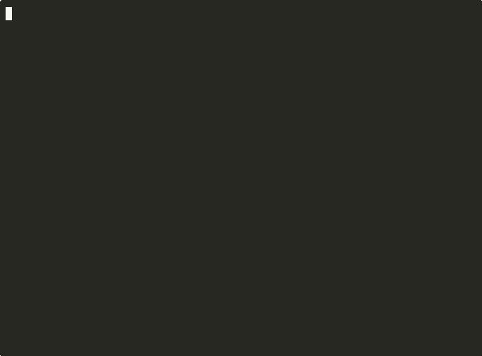
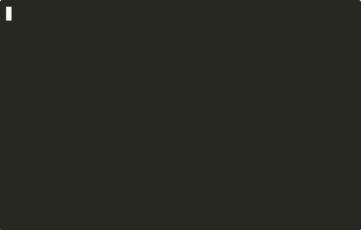

# Widget Showcase

FluffyUI ships multiple showcase-style demos so you can explore the widget catalog quickly.

<a href="demos/hero.gif" target="_blank"></a>

Run the lightweight sampler:

```bash
go run ./examples/showcase
```

Run the full kitchen-sink view (inside Candy Wars):

```bash
go run ./examples/candy-wars
```

In Candy Wars, switch to the **Showcase** tab for a scrollable, two-column widget sampler.

Run the full widget gallery:

```bash
go run ./examples/widgets/gallery
```

### Widget Highlights

| Buttons & Inputs | Tables & Lists | Charts & Feedback |
|:-:|:-:|:-:|
| <a href="demos/buttons.gif" target="_blank"></a> | <a href="demos/table.gif" target="_blank"></a> | <a href="demos/sparkline.gif" target="_blank"></a> |
| <a href="demos/input.gif" target="_blank"></a> | <a href="demos/list.gif" target="_blank"></a> | <a href="demos/progress.gif" target="_blank"></a> |

| Select & Checkbox | Sliders & TextArea | Navigation |
|:-:|:-:|:-:|
| <a href="demos/select.gif" target="_blank"></a> | <a href="demos/slider.gif" target="_blank"></a> | <a href="demos/tabs.gif" target="_blank"></a> |
| <a href="demos/checkbox.gif" target="_blank"></a> | <a href="demos/textarea.gif" target="_blank"></a> | <a href="demos/dialog.gif" target="_blank"></a> |

| Reactive State | Graphics & Animation | Full Applications |
|:-:|:-:|:-:|
| <a href="demos/counter.gif" target="_blank"></a> | <a href="demos/easing.gif" target="_blank"></a> | <a href="demos/video.gif" target="_blank"></a> |
| <a href="demos/fireworks.gif" target="_blank"></a> | <a href="demos/graphics.gif" target="_blank"></a> | |

The docs TUI viewer (`go run ./docs/site`) picks up this page as part of the site navigation.
